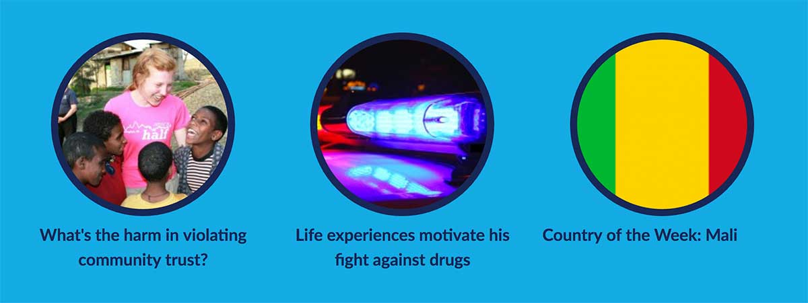

# Widget: Article List Feed

* Requires at least: 3.0.1
* Tested up to: 3.4
* Stable tag: 4.3

## Table of Contents

- [Description](#description)
- [Configuration Options](#configuration-options)
- [Usage](#usage)
- [Sample View](#sample-view)
- [Licensing](#licensing)

## Description

The Article Feed widget is a React component that pulls and displays content from the Content Distribution Platform (CDP) using the CDP public api. It accepts a number of configuration options to determine how and what to display.  

## Configuration Options

#### Data options
Determines what content is pulled

| Option | Description |
| ------ | ----------- |
| selector   | DOM element that component will attach itself to |
| sites | Elastic search indices to search. If left blank will search all available indices ( [indices](#indices) ) |
| size    | Number of results to return |
| types   | Element content type to return ( [types](#types) ) |
| langs | Element language to return ( [languages](#langs) ) |
| tags    |  Tags associated with element |
| categories   | Categories associated with element |


#### Display options 
Deetermines how the content is displayed. All display options are added under a `ui` property in the configuration object.  See [usage](#usage) for an example.

| Option | Description |
| ------ | ----------- |
| layout   | How should properties within component lay themeselvesout: default or blog style |
| direction | Direction of feed: row (default) or column |
| image    | Thumbnail image that appears in the feed |
| image -> shape   | Shape of image: rectangle (default) or circle |
| image -> width | Width of image |
| image -> borderWidth  |  Width of image border |
| image -> borderColor   | Color of image border |
| image -> borderStyle  | Style of image border (standard html border styles)  |

## Usage

Laod the css and js article feed files and then initialize the article feed widget. NOTE: as this widget is currently under development, the css and js file locations will move.

`https://s3.amazonaws.com/iip-design-stage-modules/modules/cdp-module-article-feed/cdp-module-article-feed.min.css`
`https://s3.amazonaws.com/iip-design-stage-modules/modules/cdp-module-article-feed/cdp-module-article-feed.min.js`

```js
  CDP.widgets.ArticleFeed.new({
    selector: '#articleFeed',
    sites: 'share.america.gov', 
    size: '3', 
    types: 'post', 
    langs: 'en-US',
    tags: 'crowdfunding, startups',
    categories: 'business',  
    ui: {
      layout: 'default',
      direction: 'row',
      image: {
        shape: 'circle',
        width: '220px',
        borderWidth: '10px',             
        borderColor: '#192856',
        borderStyle: 'solid'
      }
    }
  }).render();
```

## Sample View
View of an article feed widget embedded on a WordPress site



## Licensing
[GNU GENERAL PUBLIC LICENSE](./LICENSE)